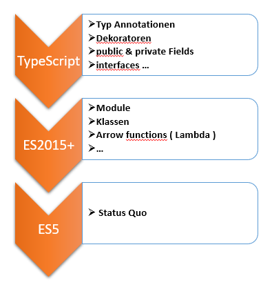
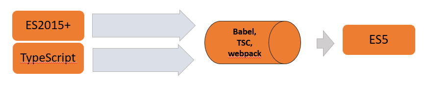

<link rel="stylesheet" href="slides.css">

# TYPESCRIPT

ppedv AG, Andreas Daxer


<!--  -->

<!-- 
LINKS

Theorie nach Themen gruppiert. Ähnlich wie unsere Demo-Dateien. Einfach nur zum Veranschaulichen. Keine Übungen oder Fragen.
https://www.tutorialspoint.com/typescript/ 

https://code.visualstudio.com/docs/typescript/typescript-tutorial

https://typescript-play.js.org/

https://en.wikipedia.org/wiki/Microsoft_TypeScript

https://de.wikipedia.org/wiki/TypeScript
-->

<article>

## INHALT

- [TYPESCRIPT](#typescript)
  - [INHALT](#inhalt)
  - [GETTING STARTED](#getting-started)
    - [TYPESCRIPT > IDEA](#typescript--idea)
    - [JS SUPERSET](#js-superset)
    - [STARTING LINKS](#starting-links)
    - [STARTING TOOLS](#starting-tools)
    - [TS INSTALL / UPDATE](#ts-install--update)
    - [COMPILING](#compiling)
    - [TSC > IDEA](#tsc--idea)
    - [TSCONFIG.JSON](#tsconfigjson)
    - [PRAXIS (Getting started)](#praxis-getting-started)
  - [TYPES > Intro](#typescript--intro)
    - [PRIMITIVES](#primitives)
    - [OVERLAPPING TYPES](#overlapping-types)
    - [SPECIAL TYPES](#special-types)
    - [ANY](#any)
    - [TS & HTML](#ts--html)
    - [TS & DOM TRAVERSING](#ts--dom-traversing)
    - [UNION TYPE](#union-type)
    - [TYPE ALIASES](#type-aliases)
    - [TYPE ASSERTION](#type-assertion)
    - [NULLABLE TYPES](#nullable-types)
    - [TYPE GUARDS](#type-guards)
  - [FUNCTIONS](#functions)
    - [FUNCTIONS > INTRO](#functions--intro)
    - [RETURNING NO DATA - VOID](#returning-no-data---void)
    - [ARGS & RETURN TYPES](#args--return-types)
    - [OPT PARAMS](#opt-params)
    - [FUNCTION CONSTRUCTOR](#function-constructor)
  - [DATA STRUCTURES](#data-structures)
    - [ARRAY](#array)
    - [DOM COLLECTIONS](#dom-collections)
  - [INTERFACES](#interfaces)
    - [INTERFACE > IDEA](#interface--idea)
    - [INTERFACE AS DATATYPE](#interface-as-datatype)
    - [READONLY](#readonly)
    - [DISCRIMINATED UNION TYPE](#discriminated-union-type)
  - [CLASSES](#classes)
    - [CLASSES > IDEA](#classes--idea)
    - [INSTANCE](#instance)
    - [MEMBERS](#members)
    - [CLASS SHORTHAND](#class-shorthand)
    - [PUBLIC & PRIVATE](#public--private)
    - [PROPERTIES](#properties)
    - [EXPORT & IMPORT](#export--import)
  - [GENERICS](#generics)
    - [GENERICS > INTRO](#generics--intro)
    - [GENERIC FUNCTION](#generic-function)
  - [DECORATORS](#decorators)
    - [DECORATORS > IDEA](#decorators--idea)
    - [DECORATOR FACTORY](#decorator-factory)
    - [DECORATORS > EXAMPLE](#decorators--example)
    - [DEMO](#demo)
  - [MORE TYPES](#more-types)
    - [UNKNOWN](#unknown)
    - [NEVER](#never)
    - [ENUMS](#enums)
    - [EXTENDING TYPES](#extending-types)
    - [INFERING TYPES](#infering-types)
    - [KEYOF](#keyof)
    - [DECLARATIONS](#declarations)
  - [FACTS](#facts)
    - [TS VERSIONS](#ts-versions)
    - [TS COMMUNITY](#ts-community)
  - [INDEX](#index)
    - [HASHTAGS](#hashtags)

</article>
<section class="page">
<article>

---

## GETTING STARTED

</article>
<article>

---

### TYPESCRIPT > IDEA

`#ts` `#typescript`

WAS IST TS

- eine Programmiersprache
- Obermenge von JavaScript
- entwickelt / maintained von Microsoft
- aktuelle Version 4.3.5 (01.06.2021)
  - `#checkForUpdates` <https://github.com/microsoft/TypeScript/releases>

WOZU IST TS

- um Fehler schon beim Kompilieren abzufangen (durch Typisierung und Code-Analyse-Tools)
- um Interfaces nutzen zu können
- um Code-Patterns besser umzusetzen
- um schneller zu programmieren
- um schneller zu debuggen

</article>
<article>

---

### JS SUPERSET



</article>
<article>

---

### STARTING LINKS

OFFIZIELLE QUELLEN

- HOMEPAGE <https://www.typescriptlang.org/>
- DOCS <https://www.typescriptlang.org/docs/home.html>
- CODE <https://github.com/microsoft/TypeScript>
- BLOG <https://devblogs.microsoft.com/typescript/>

</article>
<article>

---

### STARTING TOOLS

`#tools`

- TypeScript Compiler tsc (um zu kompilieren: tsc yourfile.ts)

---

wenn **node.js und npm** genutzt werden, dann:

- nodejs & npmjs (um ts zu installieren: npm i -g typescript)
- Visual Studio Code (VSC)
- VSC Erweiterungen für TS / JS
  - TSLint / ESLint (muss für TS noch eingestellt werden)
  - JavaScript Snippets
- VSC Erweiterungen für HTML
  - open in browser

<!--   - auto rename tag von Jun Han
  - live server (auto update im Browser bei Änderungen in HTML, JS oder CSS) -->

---

Wenn **MSBuild und Visual Studio** genutzt werden, dann:

- TypeScript als NuGet-Paket oder als VS-Erweiterung
- Visual Studio

---

Befehle aus der **VSCode-Command-Palette** (`ctr` + `shift` + `p`):

- TypeScript: Go To Project Configuration
- TypeScript: Select TypeScript Version
- TSLint: Manage workspace library execution

---

DEBUGGING

Mit Hilfe einer **map-Datei** sind Browser fähig, in ihren DevTools nicht die JS- sondern die TS-Datei zum Debuggen anzuzeigen.

Um die map-Datei erstellen zu lassen, muss die Option **'sourceMap'** in tsconfig auf 'true' gesetzt werden:

```json
"sourceMap": true, /* Generates corresponding '.map' file. */
```

Weitere Infos:

- devtools in Firefox für TS <https://hacks.mozilla.org/2019/09/debugging-typescript-in-firefox-devtools/>

</article>
<article>

---

### TS INSTALL / UPDATE

TypeScript muss global installiert werden.
<!-- //wenn man zum ersten Mal installiert, dann nur global, sonst funktioniert tsc nicht -->
```bash
npm install --global typescript@latest
```

<!-- 
npm init –y (oder strg ö) //für package.json
npm install @types/node -save-dev //für package-lock.json und node-modules
-->

---

TS UPDATE

Aktualisiert wird TypeScript mit dem gleichen Befehl

```bash
npm install -g typescript@latest
```

</article>
<article>

---

### COMPILING

An HTML-Dateien können **nur JS-Dateien** angeschlossen werden. Das heißt, um TS-Code auszutesten, braucht man seine kompilierte JS-Version.



Mit 'tsc --init' wird eine **TS-Config**-Datei angelegt.

Die Stelle, wo diese Datei angelegt wird, entscheidet, in welchen Ordnern der Compiler nach den TS-Dateien nachschauen soll.
<!-- Kompilierenoptionen für TS in tsconfig.json

```json
{
    "compilerOptions": {
        "module": "commonjs",
        "sourceMap": true,
        "watch": true
    }
}
``` -->
</article>
<article>

---

### TS USE

Wenn eine tsconfig-Datei erstellt wurde, dann gibt es 2 Möglichkeiten zu kompilieren:

1. **Alle Dateien** automatisch kompilieren lassen
2. Eine **Datei** kompilieren lassen

---

Option 1:

```bash
tsc -w
```

Das startet den watch-Modus.

---

Option 2:

```bash
tsc dateiname.ts
```

oder in der ts-Datei direkt: `strg shift b`. 'B' steht für 'build'.

<!-- 
When input files are specified on the command line, tsconfig.json files are ignored.
 -->
</article>
<article>

---

### TSC > IDEA

`#tsc`

WAS IST TSC

- ein CLI (command line interface) Programm / Tool
- tsc: TypeScript Compiler
- Version ist gleich wie vom npm-Paket 'typescript'

Was genau und wie der Compiler seine Arbeit **für ein TS-Projekt** erledigen soll, ist in der Datei **'tsconfig.json'** definiert.

Der Compiler hat aber im globalen Scope seine **Default-Einstellungen**.

Anwesenheit der tsconfig.json-Datei in einem Verzeichnis markiert es als **Root von einem TS-Projekt**.

Das heißt, beim Aufruf von tsc in watch-Modus werden die Dateien ab dem Verzeichnis beobachtet, wo tsconfig liegt, und nicht ab dem Verzeichnis, aus welchem tsc gestartet wurde.

</article>
<article>

---

### TSCONFIG.JSON

Unter anderem wird hier definiert,

- in welche **JS-Version** kompiliert werden soll
- wo die **JS-Dateien** landen sollen
- ob **strict-Modus** bei JS angewendet werden soll

Bei der mit 'tsc --init' erstellten Datei steht ein **Kommentar bei jeder Konfiguration**.

Das erleichtert das Anpassen von Config-Optionen.

COMPILER CONFIGURATION

```json
{
  "compilerOptions": {
    /* Visit https://aka.ms/tsconfig.json to read more about this file */

    /* Basic Options */
    // "incremental": true,                         /* Enable incremental compilation */
    "target": "es5",                                /* Specify ECMAScript target version: 'ES3' (default), 'ES5', 'ES2015', 'ES2016', 'ES2017', 'ES2018', 'ES2019', 'ES2020', 'ES2021', or 'ESNEXT'. */
    /* ... viele weitere Optionen */
    /* ... */
  }
}
```

<!-- ```json
"compileOnSave": false,
"compilerOptions": {},
"files": [ "core.ts", "types.ts" ],
"include": [ "src/**/*" ],
"exclude": [ "node_modules", "**/*.spec.ts" ]
```
 -->
</article>
<article>

---

## Praxis Getting started

Ablauf
- m001 Vorübung
- m001 Ablauf
</article>
</section>
<section class="page">
<article>

---

## TYPES

</article>
<article>

---

### TYPES > INTRO

TYPISIERUNGSARTEN BEI SPRACHEN

- JS - **dynamische** Typisierung (Fehler treten erst beim Ausführen auf)
- TS - **statische** Typisierung (Fehler treten schon beim Compilieren auf)

Statisch-typisierte Sprachen verlangen die Typdeklarationen von Sprachkonstrukten schon bevor sie genutzt werden.

Datentypen unterstützen insbesondere die Entwicklungsumgebung:

- Auto-**Vervollständigung**
- **Fehlermeldungen** bei nicht passenden Datentypen (**Type-Checking**)

Beim build: TypeScript wird in JavaScript übersetzt, alle Typeninformationen gehen dabei verloren.

</article>
<article>

---

### TYPE CHECKING

Datentypen werden von 'Type-Checking' **beim Deklarieren** von Variablen ermittelt.

**Entweder** durch die Angabe vom **Datentyp**:

```js
let vorname: string;
// und später irgendwann:
vorname = 'Andreas';
```

**Oder** durch unmittelbare **Initialisierung**. Dann wird der Datentyp am Wert ermittelt:

```js
let nachname = 'Krause'; // nachname ist ein string
```

**Beides** (Typangabe und Initialisierung) geht auch:

```js
let alter: number = 40;
```

</article>

<!-- <article>

---

### TYPE SYSTEM

</article> 
-->

<article>

---

### PRIMITIVES

Gleich wie in JS:

```js
let completed: boolean = false;
let age: number = 32;
```

Obwohl TS strict typisiert ist, es gibt **keine** separaten Datentypen für **Ganz- und Gleitkommazahlen**

- boolean
- string
- number
- void
- never
- undefined
- null
- any (Top-Type, Universal Supertype, #v1.0+)
- unknown (noch ein Top-Type, #v3.0+)

Spezielle Typen wie void, never und unknown werden in späteren Kapiteln behandelt.

### OVERLAPPING TYPES

Begriffe:

- overlapping types / Typen, die sich überschneiden
- compatible types / kompatible Typen
- subtype compatibility / Untertyp-Kompatibilität
- assignment compatibility / Zuweisung-Kompatibilität

### SPECIAL TYPES

- union types
- tagged union types
- intersection types
- type aliases

Spezielle Datentypen werden im Kapitel 'More Types' behandelt.

</article>
<article>

---

### ANY

Kompatibilität von any:

- any = [ _primitive_ | object ]
- [ _primitive_ | object ] = any

any: lässt alle Typen zu

```ts
let inputBox: any = document.querySelector('#inputbox');
```

</article>
<article>

---

### TS & HTML

Für HTML-Elemente gibt es in JS **vordefinierte Objekte**. Z.B. mit dem Tag `` wird ein HTMLImageElement angelegt.

In TS wird auf die **Struktur von solchen Objekten** strengst geachtet. Z.B. HTMLParagraphElement hat Eigenschaft 'textContent' aber nicht die Eigenschaft 'value'. Und bei HTMLInputElement umgekehrt: Eigenschaft 'value' ist drin, 'textContent' aber nicht.

Aber **nicht alle HTML-Tags** haben entsprechende Objekte. Z.B. für `<header>` gibt es kein HTMLHeaderElement, ein TS-Äquivalent zu Header ist ein höheres Objekt in der Prototypenkette, nämlich HTMLElement.

<!-- 
https://medium.com/better-programming/typescript-reactjs-the-element-vs-reactelement-vs-htmlelement-vs-node-confusion-6cda21315ddd -->

</article>
<article>

---

### TS & DOM TRAVERSING

`#traversing` `#DOM-quering`

Es ist zu beachten, einige DOM-Traversing-Methoden (wie 'getElementById' als Beispiel) geben ein HTMLElement zurück. Also kein HTMLParagraphElement oder ein HTMLDivisionElement. Es wird ein allgemeineres Objekt 'HTMLElement' zurückgegeben. 

Das liegt daran, dass die Methode 'getElementById()' anhand von der übergebenen ID nicht ermitteln kann, welche Art von einem HTML Element abgefangen wird. Um alle möglichen Varianten zu bedecken, wird die Rückgabe als Datentyp geliefert, von welchem alle genaueren HTML Elemente abgeleitet sind. Nämlich 'HTMLElement'-Typ.

Das gefundene Element kann man zu dem gewünschten Datentyp aber wie folgt anpassen:

```ts
// assert the return value from getElementById
const div:HTMLDivElement = document.getElementById('div_id') as HTMLDivElement;
```

<!-- 
https://medium.com/better-programming/typescript-reactjs-the-element-vs-reactelement-vs-htmlelement-vs-node-confusion-6cda21315ddd -->

</article>
<article>

---

### UNION TYPE

Union Type kann als Datentyp bei Variablen eingesetzt werden, die **Werte von mehreren Datentypen** akzeptieren sollen

```ts
let figure: string | number | undefined
```

<article>

---

### TYPE ALIASES

Wird ein Uniontype (oder ein anderer benutzerdefinierter Datentyp) **öfter verwendet**, kann dieser mit dem Schlüsselwort **`type`** angelegt werden:

```ts
type myStringNumberType = string | number
let figure: myStringNumberType
```

Schlüsselwort `type` für benutzerdefinierte Datentypen.

```ts
type C = { a: string, b?: number }
function f({ a, b }: C): void {
// ...
}
```

<!-- 
http://www.typescriptlang.org/docs/handbook/advanced-types.html#type-aliases
 -->

</article>
<article>

---

### TYPE ASSERTION

<!-- 
http://www.typescriptlang.org/docs/handbook/basic-types.html#type-assertions
-->
'Assertion' zu Deutsch: 'Behauptung'.

Type-Assertion ist **kein Type-Casting**, es gibt keine Typ-Prüfung.

Der Programmierer 'behauptet', dass eine bestimmte Variable von einem bestimmten Typ ist.

Es wird dem Compiler gesagt: 'wir sind sicher, der Wert der Variable entspricht dem angegebenen Datentyp.'

Zwei Schreibweisen:

- `as` - as-syntax
- `<>` - angle-brackets syntax

<!-- 
The reason we need to do so in this case is that getElementById's return type is HTMLElement | null. Put simply, getElementById returns null when it can't find an element with a given id. We're assuming that getElementById will actually succeed, so we need to convince TypeScript of that using the as syntax.
-->

```ts
// 1.
let someValue1: any = "this is a string";
let strLength1: number = (<string>someValue).length;

// 2.
let someValue2: any = "this is a string";
let strLength2: number = (someValue as string).length;
```

</article>

<!-- <article>
### NON NULLABLE TYPES
Normalerweise akzeptieren alle Datentypen in TS neben eigenen Werten noch 'null' und 'undefined'. 
Ist das nicht gewünscht, dann siehe hier:
<https://github.com/Microsoft/TypeScript/pull/7140>
</article> -->

<article>

---

### NULLABLE TYPES

Eine besondere Bedeutung haben die Unions mit den Optionen `null` oder `undefined`.

Die Methode 'getElementById()' liefert z.B. ein HTMLElement zurück, falls ein HTMLElement mit der angegebenen ID existiert, oder ein 'null', falls das Element nicht gefunden wurde.

Eine Variable, die die Rückgabe von dieser Methode abfängt, muss den entsprechenden Datentyp haben, nämlich 'HTMLElement | null'.

Wurde ein HTMLElement gefunden und man will weitere Operationen daran vornehmen, bekommt man die Fehlermeldung 'das Element ist möglicherweise ein null'.

<!-- [https://stackoverflow.com/questions/53050011/remove-null-or-undefined-from-properties-of-a-type] -->

- `!` - non-null assertion operator
- `?` - optional property access operator

<!--
Zu kompliziertes Beispiel. Hier braucht man Kenntnisse zu Mapped Types, Keyof und Generics
```ts
type TypeWithoutUndefined<T> = { 
  [P in keyof T]: Exclude<T[P], null | undefined> 
  };
TypeWithoutUndefined<number>
``` 
-->

---

NON NULL ASSERTION

Operator '!' löscht die **Option 'null' oder 'undefined'** bei einer Variable mit nullable Union.

Unoffiziell nennt man die Schreibweise mit dem '!'-Operator als Bang-Syntax.

```ts
let userName: string = (<HTMLInputElement> document.getElementById('user')!).value;
```

<!-- 
https://www.tutorialspoint.com/typescript/typescript_union.htm
-->

---

OPTIONAL CHAINING

<!-- <https://www.typescriptlang.org/docs/handbook/release-notes/typescript-3-7.html#optional-chaining> -->

Operator '?' unterdrückt die Fehlermeldung von TS, dass ein Ausdruck eventuell 'null' oder 'undefined' ist.

```ts
let x = foo?.bar.baz();
```

Das entspricht dem Ausdruck

```ts
let x = foo === null || foo === undefined ? undefined : foo.bar.baz();
```

Das bedeutet, wenn foo null oder undefined ist, ein undefined wird rauskommen, sonst wird die Anweisung ausgeführt.

Der Operator `?` nach dem foo, unterdrückt nicht die TS-Hinweise bezüglich 'bar'.

</article>
<article>

---

### TYPE GUARDS

Typ-Wärter / Typ-Wächter

- typeof
- instanceof
- in
- benutzerdefinierter Typ-Wächter

---

USER DEFINED TYPE GUARD

Benutzerdefinierter Typ-Wächter ist eine Funktion.

Rückgabetyp dieser Funktion ist ein Typ-Prädikat.

</article>
</section>
<section class="page">
<article>

---

## FUNCTIONS

</article>
<article>

---

### FUNCTIONS > INTRO

Typescript prüft, ob die **Anzahl von Parametern** der Anzahl der Argumente in der Funktionsdefinition entspricht.

```ts
function greeter(person){…}
greeter(); // error: expected 1 argument
```

</article>
<article>

---

### RETURNING NO DATA - VOID

Funktionen **ohne return-Ausdruck** geben trotzdem einen Wert zurück.

Dieser Wert ist vom Datentyp **'void'**.

void ist kompatibel mit undefined und null.

```ts
function warnUser(): void {
  alert('this is a warning message');
}
```

</article>
<article>

---

### ARGS & RETURN TYPES

Wir können Parametertypen und Rückgabetypen angeben

```ts
function repeatString(text: string, times: number): string {
  return ...;
}
```

</article>
<article>

---

### OPT PARAMS

Optionale Parameter.

Eine Funktion kann **mit oder ohne optionale Parameter** aufgerufen werden.

Es ist nützlich, weil TS die Anzahl von übergebenen Argumenten überprüft.

```ts
function buildName(
    firstName: string, lastName?: string
): string
{
  return firstName + ' ' + lastName;
}
```

Optionale Parameter werden bei den Funktionsdefinitionen **nach den obligatorischen** Parametern angegeben.

</article>
<article>

---

### FUNCTION CONSTRUCTOR

In TS kann man Funktionen auch mit dem **Konstruktor 'Function()'** anlegen:

```ts
let myFunction = new Function("a", "b", "return a * b"); 
let x = myFunction(4, 3); 
console.log(x)
```

<!--
</article>
<article>
### CALLBACKS
Callbacks können als anonyme Funktionen in der klassischen und in der Pfeilfunktion-Syntax angelegt werden.
Problem mit setInterval und clearInterval in Node
-->

</article>
</section>
<section class="page">
<article>

---

## DATA STRUCTURES

</article>
<article>

---

### ARRAY

Die meist verbreitete Struktur in Programmiersprachen ist ein Array.

Es gibt **zwei Schreibweisen** für Arrays als Datentyp in TypeScript:

- _itemDataType_[ ]
- Array<_itemDataType_>

z.B.:

```ts
// _itemDataType_[ ]
let names: string[]
names = ['Anna', 'Bernhardt', 'Caroline']

// Array<_itemDataType_>
let numbers: Array<number>
numbers = [34, 546.234, 143]

let mischmasch: Array<any>
mischmasch = [1, true, "text"]
```

---

Es gibt zwei Arten von Konstruktoren für Arrays, mit jeweils drei Overloads (Varianten)

**Nicht generischer Konstruktor**:

- Array()
- Array(_anzahlVonEinträgen_)
- Array(_einträge_)

z.B.

```ts
let names1 = new Array()
let names2 = new Array(4)
let names3 = new Array('Max', 'Maxim', 'Maximilian')
```

**Generischer Konstruktor**:

- Array<_datenTypVonEinträgen_>()
- Array<_datenTypVonEinträgen_>(_anzahlVonEinträgen_)
- Array<_datenTypVonEinträgen_>(_einträge_)

z.B.

```ts
let numbers1 = new Array<number>()
let numbers2 = new Array<number>(3)
let numbers3 = new Array<number>(345, 324, 234)
```

</article>
<article>

---

### DOM COLLECTIONS

Nutzt man die DOM-Traversing-Methoden, um Elemente in HTML (DOM) zu selektieren, bekommt man verschiedene Strukturen zurück.

Methode `getElementsByTagName()` liefert `HTMLCollectionOf<T>` zurück.

Methode `getElementsByName()` liefert `NodeListOf<T>` zurück.

Das sind generische Strukturen. Die nicht generischen Varianten davon sind `HTMLCollection` und `NodeList`.

<!--
### TUPLES

[ˈtjuːp(ə)l]
dt: ein Tupel
ru: кортеж

### OBJECTS

Optionale Eigenschaften

```ts
```
https://www.typescriptlang.org/docs/handbook/2/everyday-types.html#object-types
-->

</article>
</section>
<section class="page">
<article>

---

## INTERFACES

</article>
<article>

---

### INTERFACE > IDEA

`#interface`

WAS IST EINE SCHNITTSTELLE IN TS

- ein Datentyp
- eine Vorlage für später zu erstellende Klassen

WOZU IST EINE SCHNITTSTELLE

- Interfaces geben vor, aus welchen Members (Mitgliedern) besteht ein komplexer Datentyp oder eine Klasse
- Interfaces geben vor, von welchem Datentyp die einzelnen Members sind

</article>
<article>

---

### INTERFACE AS DATATYPE

In TS ist es möglich, bei einer Variable das angelegte **Interface als Datentyp** zu benutzen.

Man braucht also **keine Klasse**, die dieses Interface implementiert.

Diese Variable ist **kompatibel mit Objekten und mit Klassen**, die (u.a.) die gleichen Member haben wie das Interface

```ts
interface Person {
  firstName: string;
  lastName: string;
}

function greetUser(person: Person) {
  return "Hello, " + person.firstName + " " + person.lastName;
}

let user = { firstName: "Max", lastName: "Mustermann"};

// Eine Variable, die dem Shape vom Interface 'Person' entspricht, wurde von der Funktion akzeptiert
document.body.textContent = greetUser(user);
```

</article>
<article>

---

### READONLY

Mit dem Modifizierwort `readonly` kontrolliert der TS-Compiler die nicht beabsichtigten Mutationen (Veränderungen) von den Eigenschaften

```ts
interface Todo {
  readonly text: string;
  readonly done: boolean;
}
```

In TS gibt es keine weiteren **Modifizierer bei Interfaces**, wie `public` oder `private`, die es in anderen Sprachen gibt.

<!-- https://mariusschulz.com/blog/read-only-properties-in-typescript -->

</article>
<article>

---

### DISCRIMINATED UNION TYPE

Ab TS-Version 2 (#v2.0+).

DE: Diskriminierte Vereinigung.

Andere Namen für diesen Datentyp: tagged union type (markierter Vereinigungstyp), in anderen Sprachen bekannt als 'Sum Type', 'Maybe', 'Option' oder 'Optional'.

Es handelt sich hier um eine Vereinigung von Datentypen (z.B. Interfaces), die mindestens eine gemeinsame Eigenschaft haben.

Diese gemeinsame Eigenschaft wird als 'tag' (Markierung) oder 'discriminant property' (diskriminante Eigenschaft) genannt.

*Obwohl 'diskriminieren' fachlich 'unterscheiden' bedeutet, wird der Begriff 'discriminant property' in TS-Dokumentation für 'gemeinsame Eigenschaft' genutzt.*

<!-- 
https://www.typescriptlang.org/docs/handbook/typescript-in-5-minutes-func.html#discriminated-unions

switch & union type
Within each case of the switch statement, the TypeScript compiler narrows the union type to one of its member types. For instance, within the "paypal" case, the type of the method parameter is narrowed from PaymentMethod to PayPal. Therefore, we can access the email property without having to add a type assertion.
https://mariusschulz.com/blog/tagged-union-types-in-typescript
-->

</article>
</section>
<section class="page">
<article>

---

## CLASSES

</article>
<article>

---

### CLASSES > IDEA

`#class`

WAS IST EINE KLASSE

- eine Datenstruktur
- ein TS-Äquivalent zu den JS Objekttypen (obwohl JS auch mittlerweile Klassen hat)
- Grundlage für Objekt orientierte Programmierung

WOZU IST EINE KLASSE

- eine Klasse gibt vor, woraus die Instanzen dieser Klasse bestehen
- Konstruktor einer Klasse gibt vor, wie diese Instanzen angelegt werden
- um thematisch verbundene Daten zusammen zu halten
- um Objekte der realen Welt in der Programmiersprache abzubilden
- oft verwendet man Klassen, um Datensätze aus den Datenbanken dem Anwendungsbenutzer zu präsentieren und zur Bearbeitung bereit zu stellen

---

### INSTANCE

`#instance` `#instanz`

WAS IST EINE INSTANZ EINER KLASSE

- eine Klasse in Programmierung ist nur ein Prototyp, eine Vorlage für eine Reihe von Objekten
- z.B. eine Klasse 'Person' definiert, mit welchen Informationen die konkreten Personen beschrieben werden
- diese konkreten Personen sind Instanzen der Klasse 'Person'

WAS IST EIN KONSTRUKTOR EINER KLASSE

- eine Funktion von einer besonderen Syntax
- wird genutzt, um Instanzen einer Klasse zu erzeugen (zu konstruieren)

---

### MEMBERS

WORAUS BESTEHT EINE TS-KLASSE

- Properties / Eigenschaften
- Konstruktor(en)
- Methoden
- Accessors / Zugriffsmethoden

<!-- 
class member order:
class {
constructor
properties
methods / handlers
}
 -->
NICHT ERLAUBT IN EINER TS-KLASSE

- Konstanten
- globale Funktionen, wie `console.log()`

</article>
<article>

---

### CLASS SHORTHAND

Props ohne Modifizierer sind automatisch public.

Beim Gebrauch von `public` bei den Argumenten im Konstruktor werden die entsprechenden Eigenschaften automatisch angelegt.

```ts
class Person {
  constructor(public name: string, public age: number) {}
}

// Kurzform für:

class Person {
  name: string;
  age: number;
  constructor(name: string, age: number) {
    this.name = name;
    this.age = age;
  }
}
```

Anderes Beispiel:

```ts
class Student {
  fullName: string;
  constructor(public firstName: string, public middleInitial: string, public lastName: string) {
    this.fullName = firstName + " " + middleInitial + " " + lastName;
  }
}
```

</article>
<article>

---

### PUBLIC & PRIVATE

Private & Public Properties

```ts
class ClockComponent {
  private formatTime(time) {
    return …
  }
  public start() {
    …
  }
}
```

<!-- 
modifier static
-->

<!-- 
this in JS/TS bei Klassenmethoden
http://blog.ppedv.de/post/Spa223;-mit-this-in-TypeScript
-->

<!-- 
Syntax mit get _Prop_ bei Klassen

protected get dataVersion(): Version { 
  protected getdataVersion(): Version {
  return Version.parse('1.0');
} 
-->
</article>
<article>

---

### Properties

Getter und Setter Methoden, um wie auf ein Field zuzugreifen, dies aber mit Code abzuschirmen. 

```ts
class Contact {

  // ...

    private _phone: string;
    get phone(): string {
        return this._phone;
    }

    set phone(number: string) {
        this._phone = number;
    }

    // ...
}
```

### Export & Import

- Aufteilung des Codes in mehrere Dateien
- Auffindbarkeit der Dateien
- Packen der Module für Web-Applikation: Webpack u.ä.

</article>


</section>
<section class="page">
<article>

---

## GENERICS

</article>
<article>

---

### GENERICS > INTRO

Bei den strengtypisierten Sprachen braucht man oft eine **Funktion oder eine Datenstruktur**, die sich an **verschiedene Datentypen** beim Aufruf anpasst.

Der Entwickler möchte in diesem Fall eine Funktion / Datenstruktur erstellen, die mit einem **bestimmten Datentyp** arbeitet. **Type-checking** muss also beim Abfangen von Werten und Befüllen von Variablen aktiv bleiben.

Man weiß aber **bei der Deklaration** nicht, **welcher Datentyp** es genau sein wird.

In diesem Fall können **generische Datentypen** helfen.

Die Funktion / Datenstruktur **bindet sich** an den benötigten Datentyp erst **beim Aufruf**.

---

Zum Beispiel, für eine Funktion, die die Elemente von einem Array zu diesem Array nochmal hinzufügt, sollte man eine separate Definition für String-Array, eine weitere Definition für Number-Array usw. schreiben:

```ts
// Funktion, die an einen bestimmten Datentyp angepasst ist, hat Nachteile
let myStringArray = ['a', 'b', 'c']

let myNumberArray = [2, 3, 4]

function makeBiggerString(arr: Array<string>): Array<string>{
    let biggerArray = arr.concat(arr)
    return biggerArray
}

function makeBiggerNumber(arr: Array<number>): Array<number>{
    let biggerArray = arr.concat(arr)
    return biggerArray
}
```

<!-- 
https://www.typescriptlang.org/docs/handbook/generics.html

siehe auch PROGRAMMING.pptx > GENERIC PROGRAMMING
 -->

</article>
<article>

---

### GENERIC FUNCTION

Oft braucht man **Funktionen**, die **mit jedem Datentyp** arbeiten können. 

Ein neuer Datentyp, wie eine Union, wird nicht helfen. Man kann nicht alles Mögliche in einer Union auflisten.

```ts
// Die vordefinierten Datentypen von TypeScript könnte man hier auflisten
type universal = string | number | boolean | ...
// Aber für den Fall, dass auch die vom Entwickler angelegten Datentypen berücksichtigt werden, hilft eine Auflistung nicht mehr.
```

Eine generische Variante von der Funktion aus der vorherigen Folie ...

```ts
function makeBiggerString(arr: Array<string>): Array<string>{
    let biggerArray = arr.concat(arr)
    return biggerArray
}
```

... könnte so aussehen:

```ts
function makeBiggerGeneric<genericType>(arr: Array<genericType>): Array<genericType>{ 
    let biggerArrayGeneric = arr.concat(arr)
    return biggerArrayGeneric
}
```

---

Die Stelle, wo man eine **Typ-Variable** definiert, ist direkt **vor den runden Klammern** für Funktionsargumente.

Der typische Name für den generischen Datentyp heißt 'T'.

```ts
// Identity prüft z.B. ob das Argument dem in <>-Klammern angegebenen Typ entspricht
function identity<T>(arg: T): T { return arg; }

let output: string = identity<string>("myString");
```

Anderes Beispiel.

```ts
// GetProperty liefert den Wert von der gewünschten Eigenschaft bei einem Objekt:
function getProperty<T, K extends keyof T>(obj: T, key: K) { return obj[key]; }
```

</article>

<!-- 
TS > OPERATORS > T[K]
indexed access operator
-->

</section>
<section class="page">
<article>

---

## DECORATORS

</article>
<article>

---

### DECORATORS > IDEA

`#decorator`

WAS IST EIN DEKORATOR

- **eine Funktion**, die an Klassen bzw. deren Members oder auch an den Funktionen-Parametern angebunden wird

WOZU IST EIN DEKORATOR

- Mit Dekoratoren lassen sich **Funktionen und Klassen** nach ihrer Instanziierung oder Aufruf **verändern**
- Mit Dekoratoren können Props, Methoden oder Parameter mit **Metainformationen** markiert werden
- Mit Dekoratoren können **Daten**, die an eine Klasse als Prop-Values oder an eine Funktion als Parameter übergeben werden, **abgefangen werden**
- Anwendungsbeispiele: **Logging**, **Caching**, **Data Validation**

---

Wenn man eine **JS-Bibliothek** (oder Framework) schreibt, dann kann man mit Hilfe von **Dekoratoren zusätzliche Werkzeuge** anlegen, die schnell eingesetzt werden können.

---

Um Dekoratoren zu aktivieren, muss eine Änderung an **tsconfig** vorgenommen werden:

```bash
tsc --target "ES5" --experimentalDecorators
```

---

Semantische Syntax für **Aufruf** eines Dekorators z.B. bei Klassen

```ts
@expression // expression muss eine Funktion sein oder eine Funktion liefern
class MyClass {
  // ...
}
```

**Definiert** werden die Dekoratoren wie ganz normale Funktionen:

```ts
function doSmthWithClass(targetClass) {
  // changes for targetClass
}
```

Als **Argument** an diese Dekorator-Funktion wird die **Klasse** übergeben, an der dieser Dekorator angwendet wird:

<!-- 
Beispiel kommt von
https://www.youtube.com/watch?v=-teubRNpDVc&ab_channel=CodemitFloW
-->

```ts
// Definition vom Dekorator
function setIdTo100(target: Function) { // Klassen sind im kompilierten Code Funktionen
  target.prototype.id = 100
}

// Aufruf vom Dekorator
@setIdTo100
class TestClass {
  id: number;
}

console.log(new TestClass().id) // druckt 100
```

---

**4 Arten** von Dekoratoren:

- Klassen-Dekoratoren
- Eigenschaften-Dekoratoren (prop decorators)
- Methoden-Dekoratoren
- Parameter-Dekoratoren

---

Es können **mehrere Dekoratoren** an einem Objekt angewendet werden. Sie werden dann der Reihe nach ausgeführt.

</article>
<article>

---

### DECORATOR FACTORY

Wenn ein Dekorator Parameter erwartet, nutzt man 'Dekoratoren-Fabrik'.

In dem Fall ist es syntaktisch eine Funktion die eine andere Funktion zurückgibt:

<!-- 
Das testen, wenn nicht funktioniert, dann nachfolgendes Beispiel -->

```ts
function setId(options: {id: number}) {
  return function (target: Function) {
    target.id = options.id;
  }  
}

@setId({id: 100})
class TestClass {
  id: number;
}

console.log(new TestClass().id) // druckt 100
```

<!-- Beispiel, genau wie im Video
https://www.youtube.com/watch?v=-teubRNpDVc&ab_channel=CodemitFloW 

Ziel: statische Prop zu ändern -->

<!-- 
```ts
function Component(options: { id: string }) {
  return function (target: Function & typeof TestClass) { // so ein Datentyp, weil elementId statisch ist, hat der Autor gemeint
    target.elementId = options.id;
  };
}
@Component({
  id: 'neu gesetzte id'
})
class TestClass {
  static elementId: string;
}

console.log(TestClass.elementId);
```

-->

<!-- 
https://www.typescriptlang.org/docs/handbook/decorators.html

@connect() 
-->
</article>
<article>

---

### DECORATORS > EXAMPLE

In Angular werden Dekoratoren verwendet, um Metadaten bei einer Klasse zu ergänzen:

```ts
@Component({
    selector: 'app-root',
    templateUrl: './app.component.html',
    styleUrls: ['./app.component.css']
})
export class AppComponent {
    name = 'Max';
    // ...
}
```

</article>
<article>

---

### DEMO

siehe Demo-Datei zu Themen

- Methodendekorator
- Prop-Dekorator
- Param-Dekorator

</article>
</section>
<section class="page">
<article>

---

## MORE TYPES

</article>
<article>

### UNKNOWN

- unknown = [ _primitive_ | object ]
- [ any | unknown ] = unknown

<!-- 
Conversion of type 'number' to type 'string' may be a mistake because neither type sufficiently overlaps with the other. If this was intentional, convert the expression to 'unknown' first.ts(2352)
 -->

<!-- 
https://mariusschulz.com/blog/the-unknown-type-in-typescript
-->

---

### NEVER

- never != [ _primitive_ | object ] (nothing is assignable to never)
- [ _primitive_ | object ] = never (never is assignable to everything)

---

### ENUMS

'enum' ist Abkürzung für 'enumeration' (Aufzählung).

'Enumerated type' auf Deutsch: Aufzählungstyp.

<!-- 
ru: перечисляемый тип, перечисление
-->

Es lässt sich wie eine Sammlung von genannten Werten beschreiben.

```ts
// Ziel: einheitlichkeit bei bestimmten Werten innerhalb von einem Team
enum lengthUnit {cm, meter, kilometer, mile}

let shiffGeschwindigkeitEinheit: lengthUnit = lengthUnit.mile
```

<!-- 
http://www.typescriptlang.org/docs/handbook/basic-types.html#enum
https://en.wikipedia.org/wiki/Enumerated_type
-->

---

### EXTENDING TYPES

```ts
type AsyncReturnType<T extends (...args: any) => any>
```

<!-- 
<https://www.jpwilliams.dev/how-to-unpack-the-return-type-of-a-promise-in-typescript>
http://www.typescriptlang.org/docs/handbook/advanced-types.html#type-aliases
<T, K extends keyof T>
http://www.typescriptlang.org/docs/handbook/advanced-types.html#index-types
 -->

</article>
<article>

---

### INFERING TYPES

```ts
T extends (...args: any) => infer U ? U :
any
```

<https://www.jpwilliams.dev/how-to-unpack-the-return-type-of-a-promise-in-typescript>

---

### KEYOF

Mit dem Operator 'keyof' bekommt man ein **Union-Type**, bestehend **aus Keys** von einem Objekttyp.

```ts
type Person = {firstname: string; lastname: string};
type Personkeys = keyof Person; // eine Union 'firstname' | 'lastname'
```

<!-- 
https://www.typescriptlang.org/docs/handbook/2/keyof-types.html
-->

<!-- 
keyof Car is completely interchangeable with 'manufacturer' | 'model' | 'year'. The difference is that if you add another property to Car, say ownersAddress: string, then keyof Person will automatically update to be 'manufacturer' | 'model' | 'year' | 'ownersAddress'. And you can use keyof in generic contexts like pluck, where you can’t possibly know the property names ahead of time. 
http://www.typescriptlang.org/docs/handbook/advanced-types.html#index-types
 -->

<!-- 
### UTILITY TYPES
```ts
// Partial<>
// Record<T,K>
// etc
``` 
-->

<!-- 
### conditional types
### mapped types 
-->

---

### DECLARATIONS

<http://definitelytyped.org/>

<!-- 
DRAFT DECLARATION FILES
TS > DECLARATION FILES > INTRO
PREPARATION REMARKS

https://www.typescriptlang.org/docs/handbook/declaration-files/introduction.html
https://stackoverflow.com/questions/35019987/what-does-declare-do-in-export-declare-class-actions

TS FUNCTIONS > DECLARE
declare function create(o: object | null): void;
create({ prop: 0 }); // OK
create(null); // OK
create(42); // Error
create("string"); // Error
create(false); // Error
create(undefined); // Error
PREPARATION REMARKS

??? what is declare

TS > DECLARATION FILES
.d.ts
@types packages
https://devblogs.microsoft.com/typescript/writing-dts-files-for-types/
https://www.typescriptlang.org/docs/handbook/declaration-files/introduction.html

PREPARATION REMARKS

Notice we installed packages enzyme as well as @types/enzyme. The enzyme package refers to the package containing JavaScript code that actually gets run, while @types/enzyme is a package that contains declaration files (.d.ts files) so that TypeScript can understand how you can use Enzyme. You can learn more about @types packages here
https://www.typescriptlang.org/docs/handbook/declaration-files/consumption.html -->
</article>
</section>

<!-- Deserializing example
https://mariusschulz.com/blog/the-unknown-type-in-typescript#example-reading-json-from-localstorage

JSON decoder Library
https://github.com/joanllenas/ts.data.json
Empfehlung von MariusSchulz.com
For the sake of completeness, a more sophisticated alternative to this approach is to use typed decoders for safe JSON parsing. A decoder lets us specify the expected schema of the value we want to deserialize. If the persisted JSON turns out not to match that schema, the decoding will fail in a well-defined manner. That way, our function always returns either a valid or a failed decoding result and we could eliminate the unknown type altogether. -->

<!-- 
https://www.tutorialspoint.com/typescript/typescript_namespaces.htm
https://www.tutorialspoint.com/typescript/typescript_ambients.htm
 -->
<section class="page">
<article>

---

## FACTS

</article>
<article>

---

### TS VERSIONS

| Datum | Version |
| --- | --- |
| 2012, 1. Okt | erschienen |
| 2014, 6. Okt | 1.1 |
| 2016, 22. Sep | 2.0 |
| 2018, 30. Jul | 3.0 |
| 2020, 21. Aug | 4.0 |

</article>
<article>

---

### TS COMMUNITY

TWITTER <https://twitter.com/typescript/>

</article>
</section>
<section class="page">
<article>

---

## INDEX

</article>
<article>

---

### HASHTAGS

Um Definition von folgenden Begriffen schnell in den Folien zu finden,
geben Sie in die Suchfunktion (`strg` + `F`) ein: # und etwas aus der Liste ein:

- class
- decorator
- DOM-quering
- instance
- instanz
- interface
- seitV3.5
- seitV3.6
- ts
- tsc
- tools
- traversing

</article>
</section>
